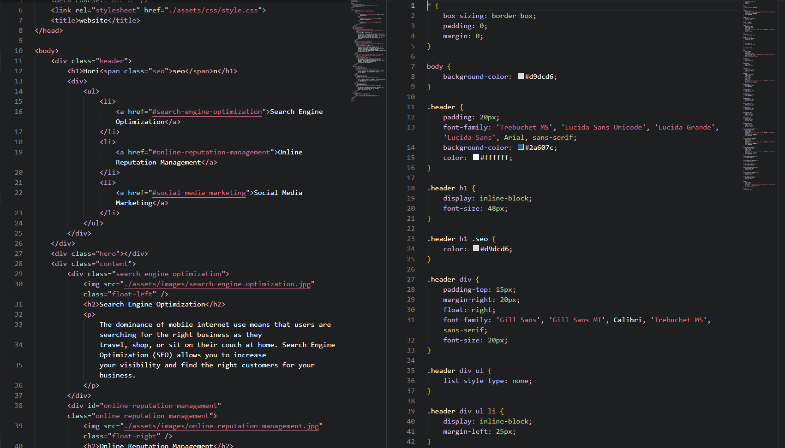
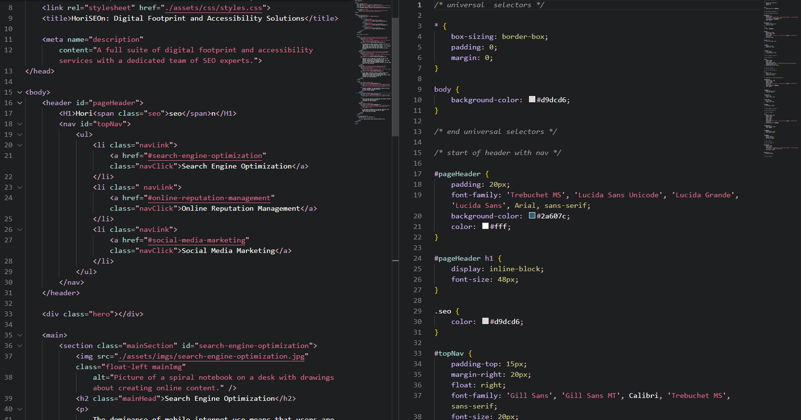

# Refactored Code for Accessibility - Horiseon

## Original Code

The HTML and CSS starter files which were provided are located [here](https://github.com/AndreaRene/Horiseon_accessibility_refactoring/tree/main/Starter_Code). Some of the issues are as follows:

* The starter HTML code was missing numerous semantic elements and was not optimized for accessibility. 
* The CSS code had repeating selectors and properties which needed to be consildated and organized. 
* The webpage had a broken link which needed to be fixed.

### An example of the starter code:

## Refactored Code

My refactored HTML and CSS files are located [here](https://github.com/AndreaRene/Horiseon_accessibility_refactoring/tree/main/Refactored_Code). Some of the steps I took to resolve the issues are as follows:

* Provided a unique title and description meta to make the website stand out on SERPs.
* Removed/replaced div elements in HTML code with more semantic elements including header, main, nav, and aside.
* added alt attributes to images in the main body of the page to provide more accessibility to users utilizing screen readers.
* Consolidated CSS selectors and properties by adding/changing classes/ids in elements with repeated styling.
* Utilized classes and ids that would support/withstand future alterations and additions to the page.
* Added commentation to CSS file.
* Fixed broken link in HTML.

### An example of the refactored code:

## Final Criteria

The completed application needs to resemble the original application's layout and functionality.

### Deployed application

[This is the site](https://andrearene.github.io/Horiseon_accessibility_refactoring/) with refactored code and matching resemblance/functionality to the original. 
